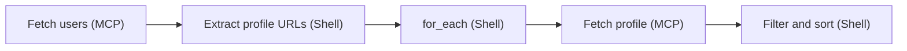
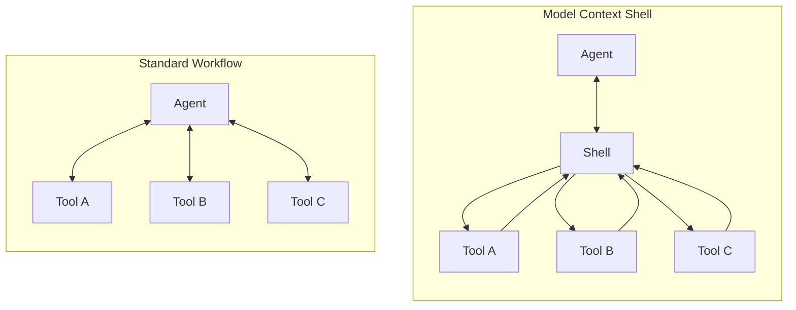

<h1 align="center">Model Context Shell</h1>

<p align="center"><b>Unix-style pipelines for MCP tools -compose complex tool workflows as single pipeline requests</b></p>

<p align="center">
<a href="#introduction">Introduction</a> &middot;
<a href="#setup">Setup</a> &middot;
<a href="#security">Security</a> &middot;
<a href="#development">Development</a> &middot;
<a href="#specification">Specification</a> &middot;
<a href="#rfc">RFC</a> &middot;
<a href="#contributing">Contributing</a>
</p>

<a id="demo-video"></a>

https://github.com/user-attachments/assets/474206f9-4a88-43d0-b4f3-3e7cfe2d743d

## Introduction

Model Context Shell lets AI agents compose [MCP](https://modelcontextprotocol.io/) tool calls using something like Unix shell scripting. Instead of the agent orchestrating each tool call individually (loading all intermediate data into context), it can express a workflow as a pipeline that executes server-side.

For example, an agent can express a multi-step workflow as a single pipeline:



This pipeline fetches a list, extracts URLs, fetches each one, filters the results, and returns only the final output to the agent. No intermediate data in context.

### Why this matters

[MCP](https://modelcontextprotocol.io/) is great, but for complex workflows the agent has to orchestrate each tool call individually, loading all intermediate results into context. Model Context Shell adds a pipeline layer: the agent sends a single pipeline, and the server coordinates the tools, returning only the final result:



| | Without | With |
|---|---|---|
| **Orchestration** | Agent coordinates every tool call, loading intermediate results into context | Single pipeline request, only final result returned |
| **Composition** | Tools combined by the agent one call at a time | Native Unix-style piping between tools |
| **Data scale** | Limited by context window | Streaming/iterator model handles datasets larger than memory |
| **Reliability** | LLM-dependent control flow | Deterministic shell pipeline execution |
| **Permissions** | Complex tasks push toward full shell access | Sandboxed execution with allowed commands only |

### Real-world example

Example query: "List all Pokemon over 50 kg that have the chlorophyll ability"

Instead of 7+ separate tool calls loading all Pokemon data into context, the agent built a single pipeline that:
- Fetched the ability data
- Extracted Pokemon URLs
- Fetched each Pokemon's details (7 API calls)
- Filtered by weight and formatted the results

Only the final answer is loaded into context, not the intermediate API responses.

In practice, agents don't get the pipeline right on the first try. They typically run a few exploratory queries to understand the shape of the data before building the final pipeline. To keep this fast and cheap, the server includes a preview stage powered by [headson](https://github.com/kantord/headson) that returns a compact structural summary of the data, enough for the agent to plan its transformations without loading the full dataset into context.

### Design

Agents already have access to full shell environments and can call any CLI tool, which overlaps a lot with what MCP tools provide. Rather than duplicating that, Model Context Shell tries to achieve similar workflows in a safer, simpler MCP-native environment. Patterns like parallel map-reduce over tool call results are uncommon today because MCP doesn't natively support them, but they're a natural fit for coordinating tool calls -imagine fetching all console errors via a Chrome DevTools MCP server and creating a separate GitHub issue for each one.

The execution engine works with JSON pipeline definitions directly. Agents construct pipelines from the MCP tool schema alone, without needing shell syntax. Commands are never passed through a shell interpreter; each command and its arguments are passed as separate elements to the underlying process (`shell=False`), so there's no shell injection. Data flows between stages as JSON, preserving types through the pipeline rather than reducing everything to strings.

It's more constrained than a general-purpose shell: only a fixed set of data transformation commands is available, and all execution happens inside a container.

### How it works

Model Context Shell is packaged as an MCP server, so any agent that supports the protocol can use it. It could also be packaged as a library built directly into an agent.

The server exposes four tools to the agent via MCP:

| Tool | Purpose |
|---|---|
| `execute_pipeline` | Execute a pipeline of tool calls and shell commands |
| `list_all_tools` | Discover all tools available from MCP servers via [ToolHive](https://stacklok.com/download/) |
| `get_tool_details` | Get the full schema and description for a specific tool |
| `list_available_shell_commands` | Show the allowlist of CLI commands |

The agent constructs pipelines as JSON arrays of stages. Data flows from one stage to the next, similar to Unix pipes. There are three stage types:

**Tool stages** call external MCP tools discovered through ToolHive:
```json
{"type": "tool", "name": "fetch", "server": "fetch", "args": {"url": "https://..."}}
```

**Command stages** transform data using allowed shell commands:
```json
{"type": "command", "command": "jq", "args": ["-c", ".results[] | {id, name}"]}
```

**Preview stages** show a summarized view of the data at any point in the pipeline, useful for the agent to understand the data structure before writing transformations:
```json
{"type": "preview", "chars": 3000}
```

Any tool stage can set `"for_each": true` to process items one-by-one. The preceding stage must output JSONL (one JSON object per line), and the tool is called once per line. Results are collected into an array. So "fetch a list of URLs, then fetch each one" is a single pipeline call, using a single reused connection.

Full example -fetch users, extract their profile URLs, fetch each profile, filter for active users:

```json
[
    {"type": "tool", "name": "fetch", "server": "fetch", "args": {"url": "https://api.example.com/users"}},
    {"type": "command", "command": "jq", "args": ["-c", ".[] | {url: .profile_url}"]},
    {"type": "tool", "name": "fetch", "server": "fetch", "for_each": true},
    {"type": "command", "command": "jq", "args": ["-c", "[.[] | select(.active)] | sort_by(.name)"]}
]
```

## Setup

### Prerequisites

- [ToolHive](https://stacklok.com/download/) (`thv`) -a runtime for managing MCP servers

### Quick start

Run the pre-built image from GitHub Container Registry:

```bash
# Linux (requires --network host)
thv run ghcr.io/stackloklabs/model-context-shell:latest --network host --foreground --transport streamable-http

# macOS / Windows (Docker Desktop bridge works automatically)
thv run ghcr.io/stackloklabs/model-context-shell:latest --foreground --transport streamable-http
```

Once running, `thv list` shows the URL and port for each running server. If you've registered your AI client with `thv client setup`, ToolHive configures it to discover running servers automatically. See the [CLI quickstart](https://docs.stacklok.com/toolhive/tutorials/quickstart-cli) for details.

Model Context Shell works with any existing MCP servers running through ToolHive, and relies on ToolHive's authentication model for connected servers.

### Adding MCP servers for testing

Model Context Shell coordinates tools from other MCP servers running through ToolHive. To try it out, start a few servers:

```bash
# See what's available in the registry
thv registry list

# Run a simple fetch server (great for testing pipelines)
thv run fetch

# Check what's running
thv list
```

You can also run servers from npm/PyPI packages directly:

```bash
thv run npx://@modelcontextprotocol/server-everything
```

For servers that need credentials (e.g. GitHub), pass secrets via ToolHive:

```bash
thv run --secret github,target=GITHUB_PERSONAL_ACCESS_TOKEN github
```

See the [ToolHive documentation](https://docs.stacklok.com/toolhive) for the full guide, including [CLI quickstart](https://docs.stacklok.com/toolhive/tutorials/quickstart-cli) and [available integrations](https://docs.stacklok.com/toolhive/integrations).

### Testing with the ToolHive Playground

The ToolHive desktop app has a built-in [Playground](https://docs.stacklok.com/toolhive/guides-ui/playground) that lets you test MCP servers interactively without setting up an external AI client. You pick a model provider, enable the servers you want to test, and chat with the model to see how it uses the tools. Every tool call is logged with parameters, results, and response time, which makes it easy to debug pipelines.

The [demo video](#demo-video) at the top of this README shows Model Context Shell being tested this way.

See the [ToolHive UI guide](https://docs.stacklok.com/toolhive/guides-ui/) for more on the desktop app.

### Tips

**Connect only Model Context Shell to your agent.** Don't connect individual MCP servers directly to the agent alongside Model Context Shell. When agents have direct access to tools, they tend to call them individually instead of composing pipelines. The server can access all your MCP servers through ToolHive automatically.

**Some agents need encouragement.** Most agents will use the shell naturally for complex tasks, but some may need a hint in their system prompt (e.g., "Use Model Context Shell pipelines to combine multiple tool calls efficiently").

## Security

ToolHive runs Model Context Shell in an isolated container, so shell commands have no access to the host filesystem or network. The MCP servers it coordinates also run in their own separate containers, managed by ToolHive.

- **Allowed commands only**: A fixed allowlist of safe, read-only data transformation commands (`jq`, `grep`, `sed`, `awk`, `sort`, `uniq`, `cut`, `wc`, `head`, `tail`, `tr`, `date`, `bc`, `paste`, `shuf`, `join`, `sleep`)
- **No shell injection**: Commands are executed with `shell=False`, arguments passed separately
- **MCP tools only**: All external operations go through approved MCP servers

## Development

### Requirements

- Python 3.13+
- [uv](https://docs.astral.sh/uv/) for dependency management

### Setup

```bash
uv sync --group dev
```

### Running tests

```bash
uv run pytest
```

### Linting and type checking

```bash
uv run ruff check .
uv run ruff format --check .
uv run pyright
```

## Specification

For now, this project serves as a living specification -the implementation _is_ the spec. A more formal specification may be extracted later.

**Execution model.** The current execution model is a scriptable map-reduce pipeline. Stages run sequentially, with `for_each` providing the map step over tool calls. This could be extended with a more generic mini-interpreter, but it probably shouldn't grow into a full programming language. Past a certain complexity, it makes more sense for agents to write code directly, or combine written code with the shell approach. That said, built-in access to tools like `jq` and `awk` already makes the pipeline model pretty capable for most data transformation tasks.

**Pipeline schema.** The pipeline stages are defined as typed Pydantic models in [`models.py`](https://github.com/StacklokLabs/model-context-shell/blob/main/models.py). FastMCP generates a discriminated-union JSON Schema from these models, so MCP clients can validate pipelines before sending them.

**ToolHive and security.** The reliance on ToolHive and container isolation is a practical choice -it was the simplest way to get a working, secure system. ToolHive handles tool discovery, container management, and networking, which lets this project focus on the pipeline execution model itself. A different deployment model could be used without changing the core concept.

## RFC

This is both a working tech demo and an early-stage RFC for composable MCP tool pipelines. Rather than writing a detailed spec upfront, the goal is to gather feedback by providing something concrete to try.

If you have thoughts, ideas, or use cases we haven't considered, share them in the [Discussions](https://github.com/StacklokLabs/model-context-shell/discussions) section.

## Contributing

Contributions and feedback welcome. See [CONTRIBUTING.md](CONTRIBUTING.md) for guidelines, including the DCO sign-off requirement.

## License

Apache License 2.0 - see [LICENSE](LICENSE) for details.
